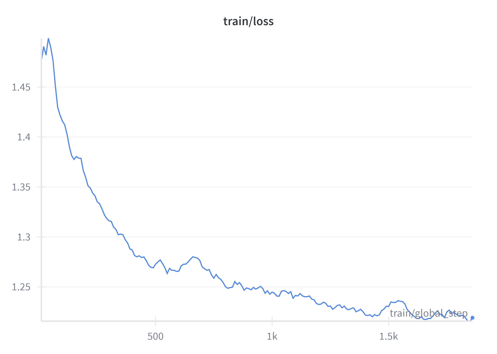

# Mixtral-8x7B QLoRA Fine-Tuning

This repository contains a complete code pipeline for fine-tuning **Mixtral-8x7B-Instruct** using **QLoRA** on the **Databricks Dolly 15k** dataset.  
Training uses **4-bit quantization** with **LoRA adapters** to reduce compute and memory cost.

---

## 📁 Repository Structure

```
├── fine_turining_QLora.ipynb          # Main fine-tuning notebook (QLoRA + Dolly 15k)
├── finetune_comparison.py        # Perplexity evaluation script
├── assets/
│   └── train_loss.png            # Training loss curve
└── README.md
```

---

##  Installation

```bash
pip install transformers peft datasets accelerate bitsandbytes
```

Requires a GPU supporting **bfloat16** and **4-bit quantization**.

---

## Fine-Tuning (Notebook)

Run the main training notebook:

```bash
fine_turining_QLora.ipynb
```

Core steps performed in the notebook:

```python
# 1. Load Dolly Dataset
dataset = load_dataset("databricks/databricks-dolly-15k", split="train")

# 2. Load Mixtral-8x7B with 4-bit quantization
bnb_config = BitsAndBytesConfig(load_in_4bit=True)
model = AutoModelForCausalLM.from_pretrained(
    model_id,
    quantization_config=bnb_config,
    device_map="auto"
)

# 3. Apply LoRA (QLoRA)
lora_config = LoraConfig(
    r=64,
    lora_alpha=16,
    target_modules=["q_proj", "v_proj"]
)
model = get_peft_model(model, lora_config)

# 4. Train
trainer = Trainer(
    model=model,
    args=training_args,
    train_dataset=train_ds,
    eval_dataset=val_ds
)
trainer.train()
```

---

## Perplexity Evaluation

Run the script:

```bash
finetune_comparison.ipynb
```

Example from the script:

```python
ppl_base = calculate_perplexity(base_model, tokenizer, val_dataset)
ppl_adapter = calculate_perplexity(model_with_adapter, tokenizer, val_dataset)

print(ppl_base, ppl_adapter)
```

---

## Training Loss Curve



---

## Summary of Improvements

- Trained only ~2% of parameters using **QLoRA**
- Reduced memory usage via **4-bit NF4 quantization**
- Improved perplexity compared to the base Mixtral model
- Stable, smooth training convergence

---

